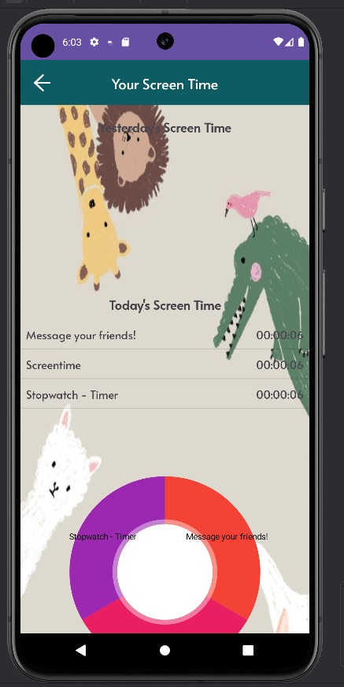
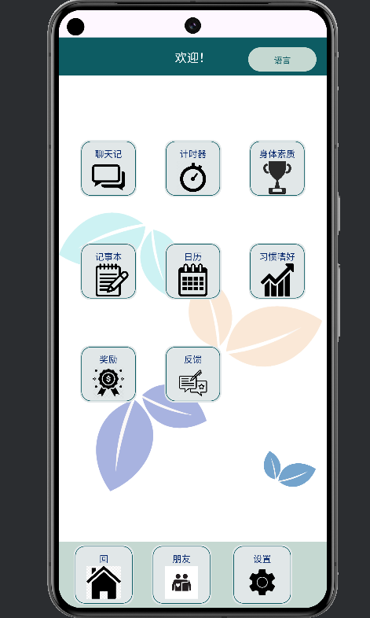

# MADTeam4
Repository for MAD Team 4 for Assignment 1 + 2.

App Name: FriendScape,
App Category: Lifestyle,
App Sub-Category: Social
---------------------------------------------------------------->
Main Introduction:
Friendscape is a lifestyle social app designed to connect you with friends in a creative and collaborative way.
Organize events, plan challenges, and celebrate milestones together with innovative features like Friendship Events and Challenges.
You can build personalized to-do lists, set study timers, or plan your meals while keeping up with friends' posts and notifications.
The app's seamless messaging system allows sharing of texts and images.
Enjoy a modern social experience with Friendscape!
---------------------------------------------------------------->
Brief Introduction (shortened):
Friendscape is a social app that connects you with friends for events and challenges.
Stay organized with to-do lists and study timers. Share texts, images, and voice messages with your friends.
Enjoy a modern social experience with FriendScape!
---------------------------------------------------------------->
Google play 80 chara intro:
Connect and explore with friends through shared activities on FriendScape!
---------------------------------------------------------------->
Google play 4000 chara intro:
Welcome to FriendScape, the ultimate app designed to help you connect, explore, and engage with friends through shared activities and interests.
In today’s fast-paced world, maintaining and nurturing friendships can be challenging.
FriendScape bridges that gap by providing a dynamic platform where you can discover new activities, plan events, and strengthen bonds with your friends!

Why FriendScape?
FriendScape stands out as a versatile and user-friendly app dedicated to enhancing your social life.
In an era where digital interactions often overshadow face-to-face connections, FriendScape encourages real-world interactions and shared experiences.
It’s more than just an app – it’s a platform that fosters meaningful relationships and unforgettable moments.

Getting Started:
Download and Sign Up: Download FriendScape from the App Store or Google Play Store.
Sign up with your email or social media accounts to get started.

Set Up Your Profile: Customize your profile by adding your interests, hobbies, and a profile picture.
This helps us suggest activities and events that match your preferences.

Explore and Connect: Start exploring activities and events right away.
Join existing events or create your own. Invite friends and start building your social calendar.

Engage and Share: Participate in activities, share your experiences, and engage with friends.
Use the interactive map to discover new opportunities and make the most of your social life.

Join the FriendScape Community:
FriendScape is more than just an app – it’s a community of like-minded individuals who value connections and shared experiences.
Join us today and start exploring, engaging, and connecting like never before.
With FriendScape, your social life is about to get a whole lot more exciting!

Download FriendScape now and embark on a journey of fun, friendship, and unforgettable experiences!
---------------------------------------------------------------->
App Features [Stage 1]:
1. Login & Home Page - Users can login/register an account + change password.
There will be a landing page designed to help users navigate the app easily.
Concepts used: Persistent Memory, Layout Manager, Firebase
Feature done by: Marissa

   
   

3. Chat & Messaging - Send and receive text messages and images between friends
Concepts used: RecyclerView, Persistent Memory, Layout Manager
Feature done by: Danial
   
   

4. Friendship Events - Users to track each other's progress in fitness challenges, personal milestones & other goals together
Concepts used: Persistent Memory
Feature done by: Jacob

5. Timer - Keep track of time when doing tasks
Concepts used: CountdownTimer, RecyclerView, Persistent Memory, Layout Management, MediaPlayer, Vibration
Feature done by: Chloe
   

6. To-Do List - Organize their to-do tasks for the day
Concepts used: Linear Layout, Persistent Memory, RecyclerView
Feature done by: Shida

---------------------------------------------------------------->
App Features [Stage 2]:
note: Old Concepts refer to concepts taught in lectures, or used in stage 1.

1. Account Page | OTP | Allow users to connect with friends - Users can view, update and delete their personal details.
OTP verification to verify its the user’s number during creation and changing password.
Creation of friend's list to be able to interact with them and allow the user to decline and accept the link's invitation.
Old Concepts used: Persistent Memory, Layout Manager, Firebase
New concepts used: CountDownTimer UI, Dynamic UI Creation, Threading, Adapter
Feature/Enhancement done by: Marissa

3. Screentime Tracker - Gives insight and tells users how long they have been on each feature.
   DailyLogin and Rewards - Allows user to gain 20 FriendCoins each time they login. Using the FriendCoins, users can buy stickers and themes to customize the app. This encourages the users to log in to the app everyday so that they can earn FriendCoins.
Users can make changes according to the screen time.
User can customize the app by buying items using FriendCoins(sending stickers in chats and changing background theme)
Old Concepts used: Foreground Service, Firebase Realtime Database, Binding to Service, Tracking Individual Features
New concepts used: Foreground Service, Binding to Service, MPAndroidChart, Flexbox Layout, Nested Scrollview, SharedPreferences
Feature/Enhancement done by: Danial

4. Personal Habit Tracker -  Allows users to set, track, and manage their personal habits.
Users can log their progress, and view their streaks and statistics over time. 
A total of 4 habits allowed to be created at any one time, to encourage users to focus on goals.
users are able to sort their data by week, month, weekday or insights, as well as switch between bar and line charts 
A insights page is also available to allow users to view critical information such as lowest and highest values, averages and durations
Old Concepts used: Persistent Memory, MPAndroidChart, Recycler View
New concepts used: MPAndroidChart
Feature/Enhancement done by: Jacob

5. Timer Enhancement & Widget - Allow users to access the feature outside of the app through a widget.
   Concepts used: CountdownTimer, RecyclerView, Databases, Widget
   New concepts used: Widget
   Feature/Enhancement done by: Chloe
   

6. Calendar - A user-friendly app that enables users to effortlessly view and manage their schedules, ensuring they stay organized and on track with their daily activities.
Old Concepts used: RecyclerView, Persistent Memory (SQLite database)
New concepts used: Nested RecyclerView, Persistent Memory DAOs (Data Access Objects), Widget
Feature/Enhancement done by: Shida
Main page: Allow users to add events their own customised events. The events are highly cutomisable, users are able to set the start and end date, set the event to an all-day event, or set a start and end time to the event.

View all event page: Users will be able to view their whole schedule according to the month and date selected.

Edit event page: Enable users to edit their events already added to ensure the details remain accurate.

8. Feedback feature -  Allow users to send feedback to the app developers, and the developers will
receive the feedback in the form of an email sent to their email account.
Old Concepts used: Firebase Realtime Database, User Interface Components, Event Handling, Firebase Operations,
New concepts used: Google Apps Script, HTTP request (API getter to retrieve data), Automatic Email Sending
Feature/Enhancement done by: Chloe
   

9. Changing Language - Allow users to switch between an English and Chinese interface. This is to provide
better user experience, as users will be able to understand and use the app based on their preferred language.
Old Concepts used: Resource Management, SharedPreferences, Activity Lifecycles, View Binding and Event Handling
New concepts used: Localization and Internalization, Locale, Configuration Modification 
Feature/Enhancement done by: Chloe
   

---------------------------------------------------------------->
App Aesthetics Information:
Colour scheme: Cool shades of green & blue, with shades of turquoise mixed in.

Green: associated with nature, health & well-being; suitable for our app since it is about lifestyle

Blue: linked with communication; suitable for our app since it has social media components

Turquoise: combines the calming properties of blue and revitalizing energy of green, & provides a perfect contrast

Beige: allows a contrast to make the elements of the app visible and pleasing to the eye

Colour Wheel & main colours used:
#F4EDEA
#0D5C63
#C5D8D1
#78CDD7

Notes:
- We have chosen for the app to be locked in Portrait Mode to provide optimal user experience.
- For some features, we have implemented the '?' feature for users to click on. This displays instructions
on how to use the feature.
- The feedback feature has been coded for the developer to receive legitimate emails whenever a user sends
feedback through the app. The developer will receive the email via gmail within a few minutes.
---------------------------------------------------------------->
